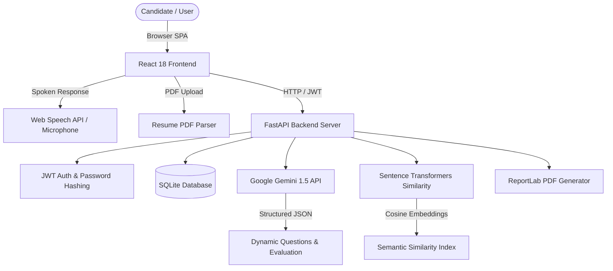

# MockMate AI - Intelligent Interview Preparation & Performance Evaluation System

[](https://fastapi.tiangolo.com/)
[](https://reactjs.org/)
[](https://ai.google.dev/)
[](https://www.sbert.net/)
[](LICENSE)

An end-to-end, production-ready **AI Technical Interviewer and Candidate Evaluation System** built as a college mini-project. 

**MockMate AI** dynamically generates domain-tailored technical interview questions using Google Gemini, evaluates candidate answers across multi-dimensional criteria (Technical Accuracy, Factual Correctness, Prompt Relevance, Grammar, Communication), computes semantic similarity using Sentence Transformers, supports voice recording with speech-to-text, parses PDF resumes for skill-targeted questions, and generates downloadable PDF evaluation reports.

---

## 📌 Project Overview & Problem Statement

Traditional technical interview preparation relies on static question lists without objective, real-time feedback. Candidates often struggle to measure technical depth, factual accuracy, and communication clarity.

**MockMate AI** bridges this gap by acting as an **Autonomous Technical Interviewer**:
1. Dynamically crafts interview questions based on domain, difficulty level, and extracted resume skills.
2. Accepts both typed text answers and spoken verbal responses.
3. Conducts multi-factor semantic evaluations combining vector embeddings and LLM reasoning.
4. Tracks candidate progress on an interactive analytics dashboard.
5. Generates downloadable PDF evaluation certificates.

---

## 🛠️ Technology Stack

| Layer | Technologies |
| :--- | :--- |
| **Frontend** | React 18, HTML5, CSS3 Responsive Design System, Chart.js, Inline Vector Icons |
| **Backend** | Python 3.11, FastAPI, Uvicorn, SQLAlchemy |
| **Database** | SQLite3 |
| **AI Engine** | Google Gemini 1.5 Flash API |
| **NLP & Similarity** | Sentence Transformers (`all-MiniLM-L6-v2`), Scikit-Learn TF-IDF, PyPDF |
| **Speech Processing**| Web Speech API & Backend Audio Whisper Transcription |
| **Auth & Security** | JWT (JSON Web Tokens), HMAC-SHA256 Password Hashing |
| **Report Generation**| ReportLab (PDF) |

---

## 🏗️ System Architecture



---

## 🚀 Features

- **Dynamic Gemini Questioning**: Tailored interview questions dynamically generated per session.
- **Multi-Factor AI Evaluation**: Multi-dimensional scoring (0-10) for Technical Accuracy, Factual Correctness, Relevance, Grammar, and Communication Quality.
- **Semantic Vector Scoring**: Computes deep semantic conceptual alignment using `SentenceTransformers` embeddings beyond simple keyword matching.
- **Voice & Speech-to-Text**: Hands-free voice interview recording with real-time speech transcription preview.
- **Resume PDF Parser**: Extracts technical skills (Python, SQL, React, AWS, DSA) to generate customized candidate questions.
- **Interactive Performance Dashboard**: Score trend charts, competency insights (Strengths & Weaknesses), and historical assessment logs.
- **PDF Report Certificates**: Downloadable performance evaluation reports generated via ReportLab.
- **Automatic Offline Demo Mode**: Built-in fallback question bank and heuristic evaluation engine for offline operation.

---

## ⚡ Quick Start & Installation

### 1. Clone the Repository
```bash
git clone https://github.com/YOUR_USERNAME/mockmate-ai.git
cd mockmate-ai
```

### 2. Install Python Dependencies
```bash
pip install -r requirements.txt
```

### 3. Environment Setup
Copy `.env.example` to `.env`:
```bash
cp .env.example .env
```
*(Optional)* Add your Gemini API key inside `.env`:
```env
GEMINI_API_KEY=your_google_gemini_api_key_here
SECRET_KEY=ai_interview_secret_key_super_secure_college_project_2026
HOST=0.0.0.0
PORT=8000
```
> **Note**: If `GEMINI_API_KEY` is left blank, MockMate AI automatically launches in **Demo Mode** with a built-in question repository and evaluation engine.

### 4. Run the Server
```bash
python run_app.py
```

Access in your browser:
- **Local Web App**: [http://127.0.0.1:8000](http://127.0.0.1:8000)
- **Same Wi-Fi Devices**: `http://YOUR_LOCAL_IP:8000`
- **Interactive API Docs (Swagger UI)**: [http://127.0.0.1:8000/docs](http://127.0.0.1:8000/docs)

---

## 📡 API Endpoints Summary

| Method | Endpoint | Description |
| :--- | :--- | :--- |
| `POST` | `/auth/register` | Register a new user account |
| `POST` | `/auth/login` | Authenticate user & return JWT token |
| `GET` | `/auth/me` | Fetch active user credentials |
| `POST` | `/resume/upload` | Upload PDF resume & extract technical skills |
| `POST` | `/interview/create` | Create session & generate dynamic AI questions |
| `POST` | `/interview/submit-answer` | Evaluate single question response |
| `POST` | `/interview/complete/{id}` | Finalize interview session & update total score |
| `GET` | `/interview/history` | Retrieve candidate interview history |
| `GET` | `/interview/{id}` | Detailed multi-factor score breakdown & feedback |
| `GET` | `/interview/{id}/pdf` | Download official PDF performance certificate |
| `POST` | `/speech/transcribe` | Transcribe voice recording file to text |
| `GET` | `/dashboard` | Retrieve overall analytics, trend graphs, strengths/weaknesses |

---

## 📄 License

This project is open-source and available under the [MIT License](LICENSE).
